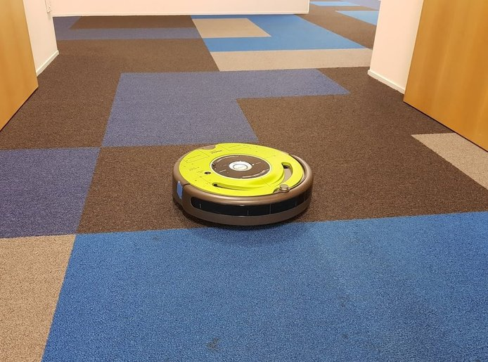
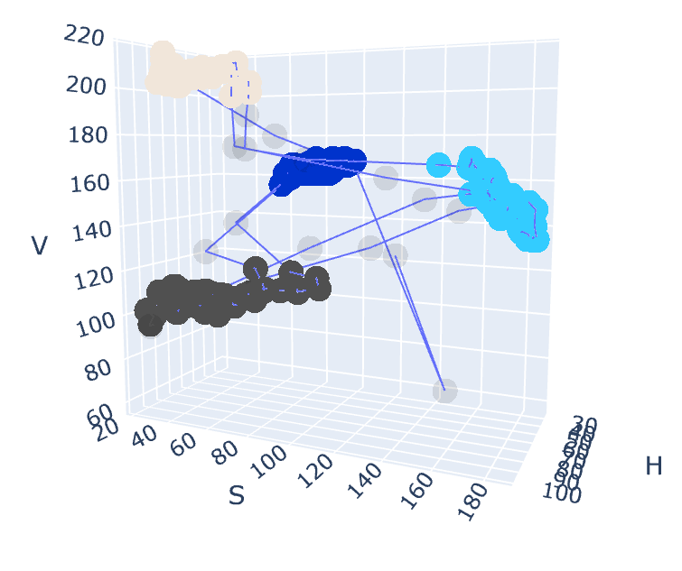

 # carpet-color-classification

Python package for distinguishing between the four colors of carpet in my office, from given images from a floor facing camera.

This is intended for use as a component in a [carpet-based robot
localisation system](https://github.com/tim-fan/carpet_localisation).



**Figure:** Robot in target localisation environment, showing the four carpet colors to be classified.

Classification is performed by taking average HSV values for each input image, and using a gaussian mixture model (GMM) to distinguish the four color clusters in HSV space.


**Figure:** GMM clustering results distinguishing the four color clusters in HSV space.


## Classifier training

For an overview on how the classifier is trained, see [this notebook](https://nbviewer.jupyter.org/github/tim-fan/carpet_color_classification/blob/main/notebooks/train_classifier.ipynb).

## Usage

See [test_carpet_color_classifier.py](carpet_color_classification/tests/test_carpet_color_classifier.py) for an example demonstrating how to construct the classifier from a parameter file, and then use the classifier on given `cv2` images.

## Tools
This package includes a utility `image_recorder` for saving images from a webcam to disk (useful in creating training or testing datasets). Usage is as follows:
```
$ image_recorder -h
image_recorder.

Saves images from webcam to disk

Usage:
    image_recorder <output_directory> [--device=<index>]

Options:
    --device=<index>    Index of video device for capture [default: 0]
```